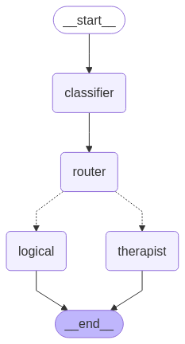

## LangGraph Test

#### Created this repo following tutorial from youtube.
[LangGraph Tutorial - How to Build Advanced AI Agent Systems](https://www.youtube.com/watch?v=1w5cCXlh7JQ&list=PL76nMeTGB6cC9zQWRwzheSwnZzLWMPTgx)

It has two files.
1. main_basic.py : creates a basic 1D graph which invokes a chatbot and returns answer

2. main.py : creates a bit more complex graph which checks the user request. Classifies it as 'emotional' or 'logical'. It redirects emotional requests to 'therapist' agent and logical request to 'logical' agent.

